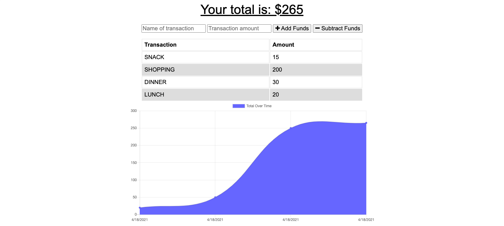

## Budget Tracker

### Description

Using Progressive Web Application (PWA) this application enables the user to add expenses and deposits to their budget with or without an online connection. When entering transactions offline, data should populate the total when connected back online.

Heroku: [Budget Tracker](https://budgettracker2021.herokuapp.com/)

### Technologies
- HTML
- CSS
- EXPRESS
- MongoDB
- Mongoose
- IndexedDB

### Usage and Installation

- To install the required dependencies, run npm install.
- To start the server, run npm start. 

### Functionality
- Enter deposits offline
- Enter expenses offline
- Offline entries should be added to tracker.

## Questions
Contact email: NEEKO_TVXQ@HOTMAIL.COM

GitHub: [NEEKO623](https://github.com/NEEKO623)

Please contact my email.